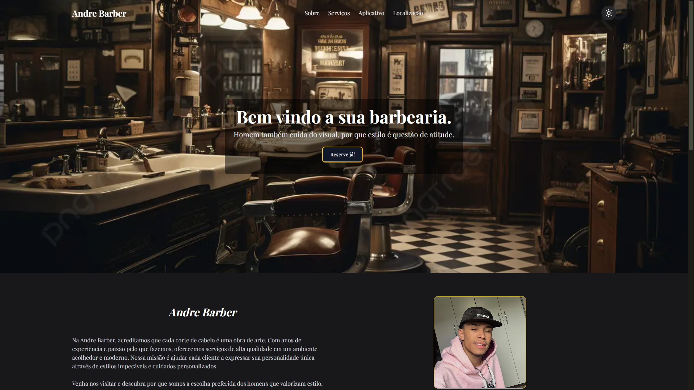
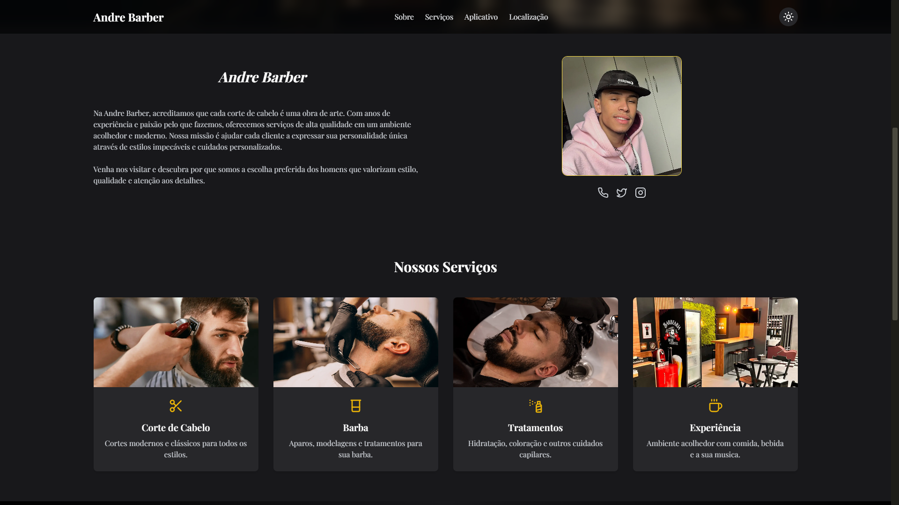
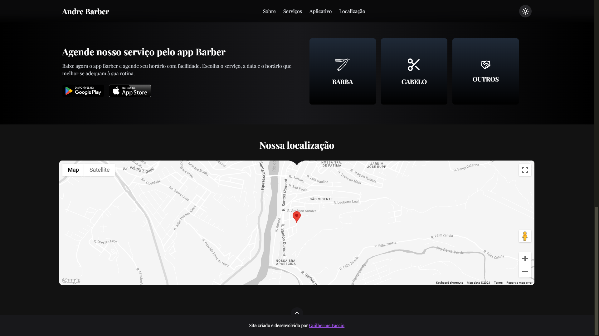

# Andre Barber

**Barbershop** A website developed for a personal client of mine; it is designed to promote their barbershop, featuring location information, support for their app, showcasing their services, and providing details about them and their space.






## Technologies Used

- **Front-end**:
  - React with TypeScript
  - Next.js for page rendering
  - Tailwind CSS for styling
  - Framer Motion for animations
  - Lucide-react for icons
  - Google API for map rendering

## How to Run the Project

1. Clone this repository:

   ```bash
   git clone https://github.com/Faccin27/BarberPro


2. Install the dependencies:

   ```bash
   npm install
   ```

3. Run the project:

   ```bash
   npm run dev
   ```

4. Access the project in the browser:
   ```
   http://localhost:3000
   ```

## Contributions

Contributions are welcome! Feel free to open a PR or report issues.
